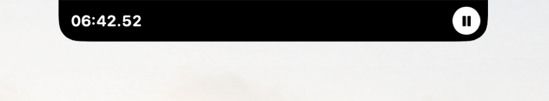
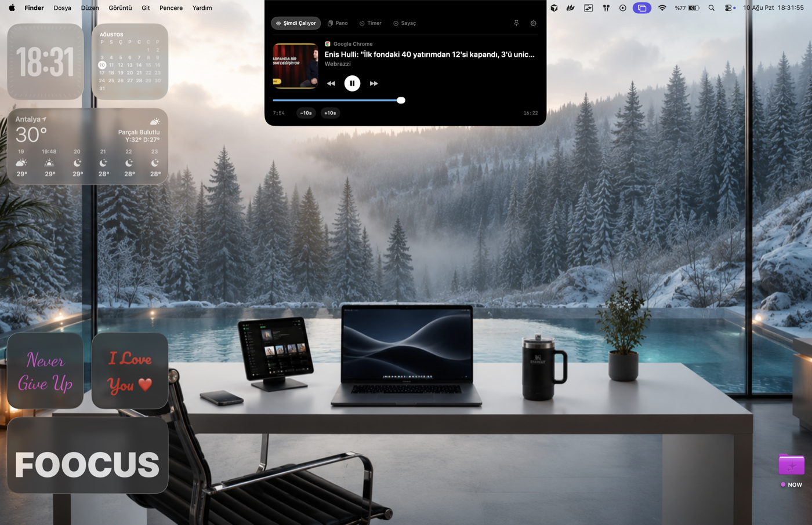
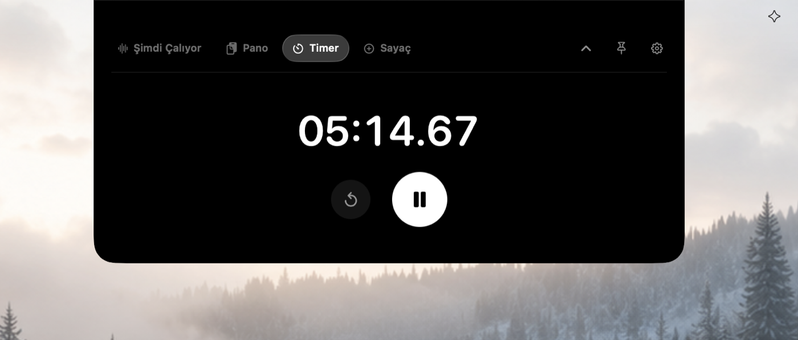
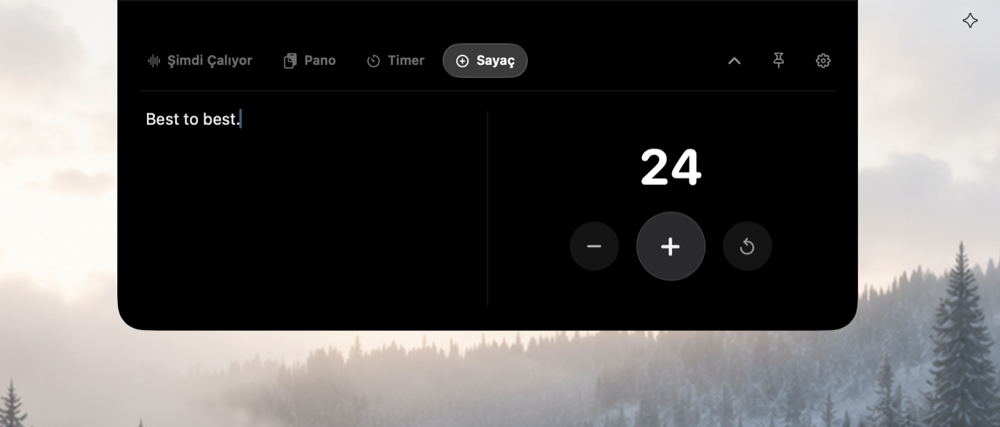
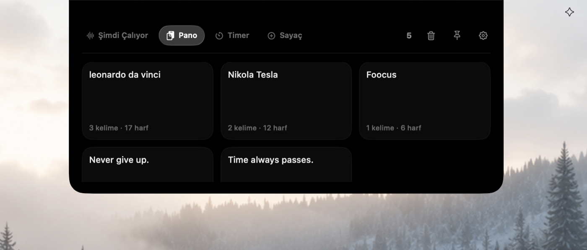

# Dyno Island

A macOS Dynamic Island–style companion that lives in the notch: Now Playing, clipboard history, a timer, and a counter — with smooth morph animations between the compact island and the expanded panel.

**Open source:** [github.com/hams-i/Dyno](https://github.com/hams-i/Dyno) · **License:** [MIT](./LICENSE)





---

## Features

- **Now Playing** — artwork, transport controls, ±10s skip, and timeline scrubbing
- **Clipboard** — persistent history for text, links, images, and files
- **Timer & Counter** — dock to the island with play/pause or +1; expand again with the chevron
- **Liquid tabs** — two-finger swipe between pages with a proportional indicator
- **Notch-locked panel** — stays with the notch across Spaces; follows the screen you click on
- **Launch at login** and bilingual UI (English / Turkish)

### Now Playing



### Timer



### Counter



### Clipboard



---

## Requirements

- macOS with a notch (or compatible menu-bar layout)
- Xcode 15+ recommended for building

## Build & run

1. Open `DynoIsland.xcodeproj` in Xcode.
2. Select the **DynoIsland** scheme and **My Mac**.
3. Run (`⌘R`).

Release app into `dist/`:

```sh
./build.sh
```

Output: `dist/DynoIsland.app`

Debug build from the command line:

```sh
xcodebuild -project DynoIsland.xcodeproj \
  -scheme DynoIsland \
  -configuration Debug \
  -derivedDataPath .build/DerivedData \
  -destination 'platform=macOS' \
  build
open .build/DerivedData/Build/Products/Debug/DynoIsland.app
```

Rebuild the MediaRemote Adapter vendor package if needed:

```sh
./Scripts/bootstrap-mediaremote.sh
```

## Technical note

macOS 15.4+ blocks direct MediaRemote access from third-party apps (`Operation not permitted`). Dyno Island reads Now Playing through [mediaremote-adapter](https://github.com/ungive/mediaremote-adapter) via a `/usr/bin/perl` helper. Suitable for personal/local use; not Mac App Store–ready.

Quit from the Dyno menu bar icon when you’re done.

---

# Dyno Island (Türkçe)

Mac çentiğinde yaşayan Dynamic Island tarzı bir yardımcı: Şimdi Çalıyor, pano geçmişi, zamanlayıcı ve sayaç. Ada ile geniş panel arasında yumuşak morph animasyonları vardır.

**Açık kaynak:** [github.com/hams-i/Dyno](https://github.com/hams-i/Dyno)


---

## Özellikler

- **Şimdi Çalıyor** — kapak, oynatma kontrolleri, ±10 sn ve zaman çizelgesi
- **Pano** — metin, bağlantı, görsel ve dosyalar için kalıcı geçmiş
- **Zamanlayıcı & Sayaç** — yukarı ok ile adaya sabitle; play/pause veya +1; aşağı ok ile yeniden genişlet
- **Liquid sekmeler** — iki parmakla sayfa kaydırma, orantılı gösterge
- **Çentiğe kilitli panel** — Spaces geçişlerinde çentikle kalır; tıkladığınız ekrana kayarak geçer
- **Sistem açılışında başlat** ve iki dilli arayüz (Türkçe / İngilizce)

### Şimdi Çalıyor


### Zamanlayıcı


### Sayaç


### Pano


---

## Gereksinimler

- Çentikli (veya uyumlu menü çubuğu düzenine sahip) macOS
- Derleme için Xcode 15+ önerilir

## Derleme ve çalıştırma

1. `DynoIsland.xcodeproj` dosyasını Xcode ile açın.
2. **DynoIsland** şemasını ve **My Mac** hedefini seçin.
3. Run (`⌘R`).

Release çıktısı `dist/` altına:

```sh
./build.sh
```

Çıktı: `dist/DynoIsland.app`

Komut satırından Debug:

```sh
xcodebuild -project DynoIsland.xcodeproj \
  -scheme DynoIsland \
  -configuration Debug \
  -derivedDataPath .build/DerivedData \
  -destination 'platform=macOS' \
  build
open .build/DerivedData/Build/Products/Debug/DynoIsland.app
```

MediaRemote Adapter paketini yenilemek için:

```sh
./Scripts/bootstrap-mediaremote.sh
```

## Teknik not

macOS 15.4+ üçüncü parti uygulamaların MediaRemote private API’sine doğrudan erişimini engeller (`Operation not permitted`). Dyno Island, “Şimdi Çalıyor” bilgisini [mediaremote-adapter](https://github.com/ungive/mediaremote-adapter) üzerinden `/usr/bin/perl` yardımcı süreciyle okur. Kişisel/yerel kullanım için uygundur; Mac App Store dağıtımına uygun değildir.

İşiniz bitince menü çubuğundaki Dyno ikonundan **Çıkış Yap** ile kapatabilirsiniz.
